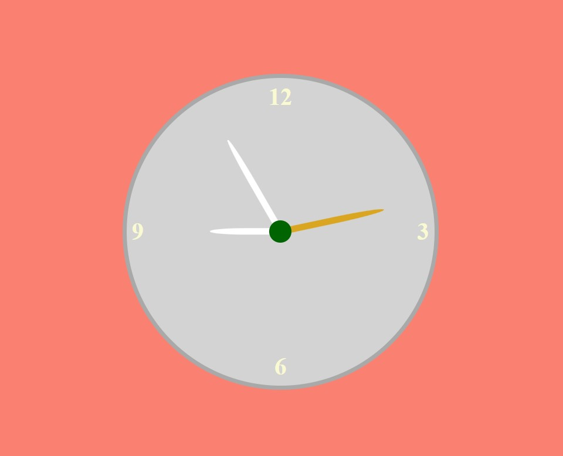

## ⏰ Analogue Clock  

A stylish **Analogue Clock** built using HTML, CSS, and JavaScript. This clock displays the current time with moving hour, minute, and second hands, giving you a classic analogue clock experience on your screen.  

## 🚀 Features  
- ✅ Real-time updating clock with **hour, minute, and second hands**  
- ✅ Smooth and accurate time representation  
- ✅ Clean and responsive UI design  
- ✅ 12-hour format clock with clear visual indicators  

## 🛠 Tech Stack  
HTML, CSS, JavaScript  

## 📷 Screenshots  
  

## 📌 How It Works  
1. The clock continuously updates with the correct time, moving the hour, minute, and second hands in real-time.  
2. The time is displayed in a traditional **12-hour format**.  
3. The clock design adapts to different screen sizes, making it perfect for any device.  

## 📥 Download & Installation  
Clone the repository using Git:  
```bash
git clone https://github.com/aklema094/Analogue-Clock.git
```  
Or download the ZIP file manually from [here](https://github.com/aklema094/Analogue-Clock/archive/refs/heads/main.zip).  
  